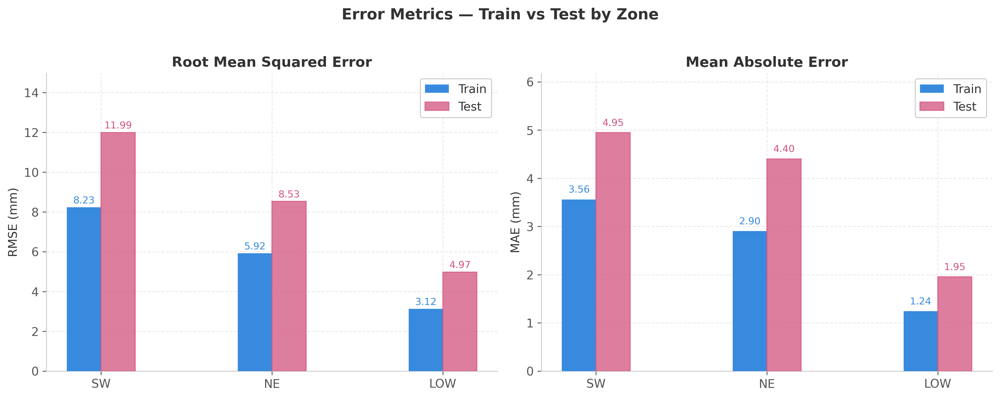
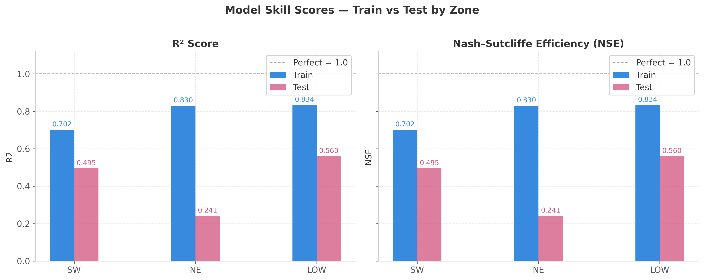
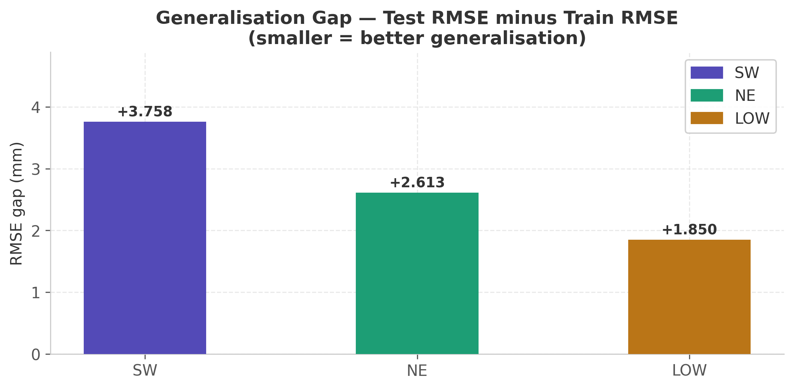
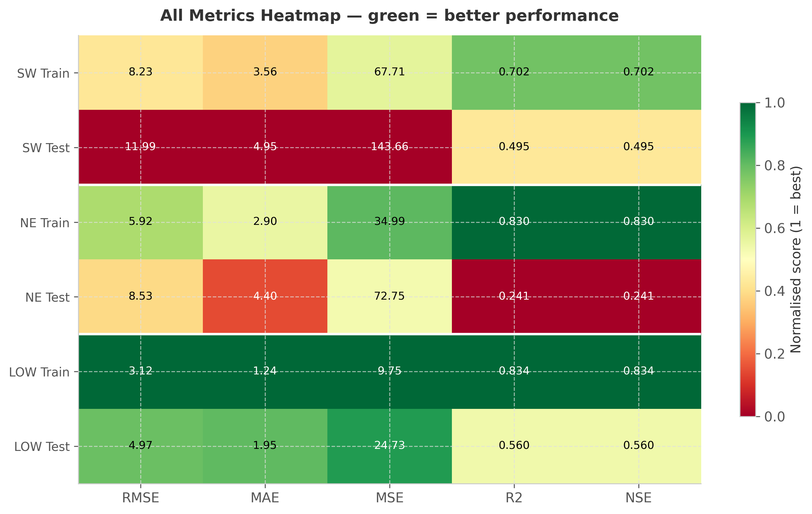
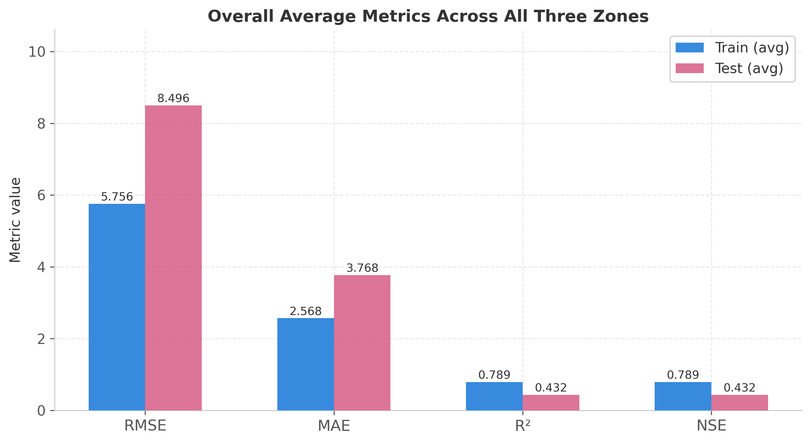
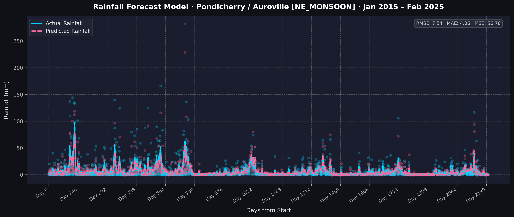
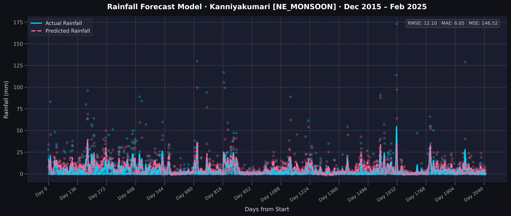
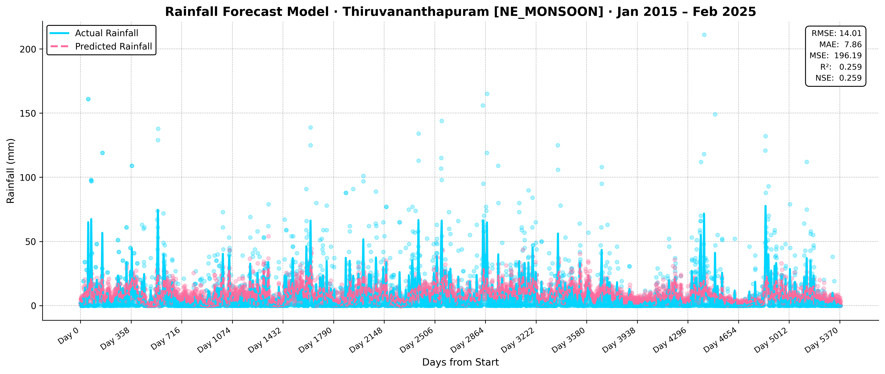
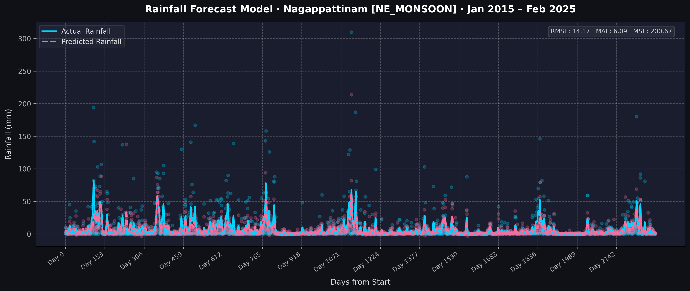

# 🌧️ Rainfall Forecast — AI Module

> **Zone-wise XGBoost rainfall forecasting across India's three monsoon regimes.**
> Each monsoon zone gets its own dedicated model, trained on hundreds of thousands of station-day records, enabling climate-aware daily rainfall predictions for any latitude/longitude in India.

---

## 📖 What This Project Does

India receives rainfall from three distinct monsoon systems — each with its own seasonality, intensity, and spatial footprint. A single global model treats all stations identically and underperforms. This project solves that by:

1. **Classifying every weather station** into one of three monsoon zones (`SW_MONSOON`, `NE_MONSOON`, `LOW_MONSOON`) based on dominant rainfall regime.
2. **Training a dedicated XGBoost model** for each zone on decade-long daily weather observations (~500 K+ records across zones).
3. **Providing an inference pipeline** that accepts any `(latitude, longitude)` coordinate, finds the 10 nearest stations, determines the dominant zone, and returns a weighted-average daily rainfall forecast.

### Key Design Choices

| Decision | Rationale |
|---|---|
| **Zone-wise modelling** | Monsoon dynamics differ sharply across regions — one model cannot capture SW orographic rainfall and NE cyclonic bursts equally well |
| **XGBoost** | Handles non-linear interactions between atmospheric physics features; robust to missing values; fast on large tabular data |
| **Autoregressive lags** (`rain_lag_1/3/7/30`) | Captures persistence — heavy rain days cluster; dry spells persist |
| **Atmospheric physics features** | Divergence, vorticity, Coriolis force, air density capture large-scale circulation beyond naive meteorology |
| **Inverse-distance weighting** | Nearby stations get proportionally higher weight in the final forecast |
| **Time-based train/test split** | Train ≤ 2023-12-31, Test ≥ 2024-01-01 — prevents data leakage across temporal folds |

---

## 📁 Project Structure

```
ai/
├── dataset/
│   ├── dataset.csv                     # Raw weather observations (input — not in git)
│   ├── processed_weather_data.csv      # Cleaned + feature-engineered (generated by Step 0)
│   ├── final_monsoon_zones.csv         # Master dataset with zone labels (generated by Step 0)
│   ├── zone_train_test_metrics.csv     # Per-zone train/test aggregate metrics (generated)
│   └── zonewise_evaluation_results.csv # Per-station evaluation results (generated)
│
├── src/
│   ├── __init__.py
│   ├── preprocess_and_zone.py                  # Step 0: clean raw data + assign monsoon zones
│   ├── ml_forecast_zones.py                    # Core: constants, model, training loop, plots
│   ├── train_rainfall_forecasting_zonewise.py  # Step 1: trains & saves 3 zone models
│   ├── forecast_rainfall_pipeline_zonewise.py  # Step 4: lat/lon → daily rainfall forecast
│   └── generate_results_plot_zonewise.py       # Step 3: generates 5 evaluation figures
│
├── models/
│   ├── SW_MONSOON/xgb_model.pkl
│   ├── NE_MONSOON/xgb_model.pkl
│   └── LOW_MONSOON/xgb_model.pkl
│
├── forecasts/
│   ├── SW_MONSOON/                     # Forecast plots for SW zone test stations
│   ├── NE_MONSOON/                     # Forecast plots for NE zone test stations
│   └── LOW_MONSOON/                    # Forecast plots for low-rainfall zone stations
│
├── report_plots/                       # 5 evaluation summary figures
│
├── requirements.txt
└── README.md
```

---

## ⚙️ Setup

### 1. Create & activate a virtual environment

```bash
python -m venv .venv
# Windows
.venv\Scripts\activate
# macOS / Linux
source .venv/bin/activate
```

### 2. Install dependencies

```bash
pip install -r requirements.txt
```

---

## 🚀 Running the Pipeline (in order)

### Step 0 — Preprocess raw data & assign zones

Reads `dataset/dataset.csv`, cleans missing values, engineers 29 features, assigns each station to a monsoon zone, and saves two intermediate datasets.

```bash
python -m src.preprocess_and_zone
```

Output files:
- `dataset/processed_weather_data.csv` — cleaned + feature-engineered data
- `dataset/final_monsoon_zones.csv` — above with `monsoon_zone` column added

> **Note:** This step requires `dataset/dataset.csv` (raw data, not tracked in git due to size).

---

### Step 1 — Train zone-wise models

Reads `dataset/final_monsoon_zones.csv`, trains one XGBoost model per zone, saves each to `models/<ZONE>/xgb_model.pkl`.

```bash
python -m src.train_rainfall_forecasting_zonewise
```

```
════════════════════════════════════════════════════════════
🌧️ Training Zone-wise XGBoost Models
════════════════════════════════════════════════════════════
🔷 ZONE: SW_MONSOON  — Train: 407,123 | Test: 117,054
🔷 ZONE: LOW_MONSOON — Train:  84,883 | Test:  32,074
🔷 ZONE: NE_MONSOON  — Train:  56,477 | Test:  15,174
✅ ALL ZONE MODELS TRAINED & SAVED
```

---

### Step 2 — Full evaluation across all stations

Runs train/test evaluation for every station per zone, prints per-zone metrics, saves CSVs.

```bash
python -m src.ml_forecast_zones
```

Output files:
- `dataset/zonewise_evaluation_results.csv`
- `dataset/zone_train_test_metrics.csv`

---

### Step 3 — Generate evaluation report plots

Creates 5 figures under `report_plots/`.

```bash
python -m src.generate_results_plot_zonewise
```

---

### Step 4 — Forecast for any location

```bash
python -m src.forecast_rainfall_pipeline_zonewise
```

Or import in your own code:

```python
from datetime import date
from src.forecast_rainfall_pipeline_zonewise import forecast_from_location

result = forecast_from_location(
    latitude=19.0760,
    longitude=72.8777,   # Mumbai
    start_date=date(2024, 6, 1),
    num_days=7,
)

for item in result.predictions:
    print(item.date_of_record, f"{item.predicted_rainfall:.2f} mm")
```

```
📍 Location : Lat:19.0760, Lon:72.8777
📅 Start    : 2024-06-01  |  Days: 7

Date           Predicted Rainfall (mm)
──────────────────────────────────────
2024-06-01                       19.46
2024-06-02                       19.46
2024-06-03                       19.46
2024-06-04                       19.46
2024-06-05                       19.46
2024-06-06                       19.46
2024-06-07                       19.46
```

---

## 🧠 Model Architecture

### Monsoon Zones

| Zone | Region Coverage | Peak Season |
|---|---|---|
| `SW_MONSOON` | Peninsular India, West Coast, Central, East, North-East | June – September |
| `NE_MONSOON` | Tamil Nadu, SE Andhra Pradesh, Kerala | October – December |
| `LOW_MONSOON` | Rajasthan, Gujarat, parts of Deccan plateau | Year-round arid/semi-arid |

### Feature Set (29 features)

| Category | Features |
|---|---|
| **Temperature** | `avg_temp`, `min_temp`, `max_temp`, `temp_k`, `temp_gradient` |
| **Pressure** | `air_pressure`, `pressure_pa`, `pressure_gradient` |
| **Wind / Dynamics** | `wind_speed`, `u_velocity`, `v_velocity`, `du_dx`, `dv_dy`, `dv_dx`, `du_dy` |
| **Derived Atmospheric** | `air_density`, `divergence`, `vorticity`, `coriolis`, `kinetic_energy` |
| **Geography** | `elevation`, `latitude`, `longitude` |
| **Autoregressive Lags** | `rain_lag_1`, `rain_lag_3`, `rain_lag_7`, `rain_lag_30` |
| **Seasonality** | `month_sin`, `month_cos` |

---

## 📊 Model Performance

### Train / Test Data Volume

| Zone | Train Records | Test Records | Train Stations | Test Stations |
|---|---|---|---|---|
| `SW_MONSOON` | 407,123 | 117,054 | 202 | 87 |
| `LOW_MONSOON` | 84,883 | 32,074 | 57 | 25 |
| `NE_MONSOON` | 56,477 | 15,174 | 24 | 11 |

> **Time split:** Train ≤ 2023-12-31 · Test ≥ 2024-01-01

---

### Zone-wise Metrics — Training Set

| Zone | RMSE (mm) | MAE (mm) | MSE | R² / NSE |
|---|---|---|---|---|
| `SW_MONSOON` | 8.53 | 3.73 | 72.79 | 0.721 |
| `LOW_MONSOON` | **3.00** | **1.20** | **9.00** | **0.849** |
| `NE_MONSOON` | 5.95 | 2.82 | 35.44 | 0.805 |

### Zone-wise Metrics — Test Set

| Zone | RMSE (mm) | MAE (mm) | MSE | R² / NSE |
|---|---|---|---|---|
| `SW_MONSOON` | 10.60 | 4.51 | 112.46 | 0.453 |
| `LOW_MONSOON` | **5.07** | **1.97** | **25.68** | **0.530** |
| `NE_MONSOON` | 9.56 | 5.00 | 91.34 | 0.440 |

### Overall (weighted average, all zones)

| RMSE (mm) | MAE (mm) | MSE | NSE / R² |
|---|---|---|---|
| 8.25 | 4.00 | 87.03 | 0.443 |

### Key Insights

- ✅ **`LOW_MONSOON`** — best generalisation: lowest test MAE (1.97 mm) and highest R² (0.530). Arid regions have stable, low-variance patterns that XGBoost captures well.
- ⚡ **`SW_MONSOON`** — moderate accuracy (R² 0.453). Large spatial variability driven by Western Ghats orography vs. inland plains is the main challenge.
- ⚠️ **`NE_MONSOON`** — hardest zone (R² 0.440). Short-duration cyclonic bursts with high temporal variability; some stations show negative NSE on extreme-event days.

---

## 📈 Evaluation Report Plots

### Fig 1 — Error Metrics (RMSE & MAE per Zone)


### Fig 2 — Skill Scores (R² & NSE per Zone)


### Fig 3 — Overfitting Gap (Train vs Test)


### Fig 4 — Metric Heatmap


### Fig 5 — Overall Summary


---

## 🗺️ Sample Forecast Plots (Actual vs Predicted)

Each plot shows daily actual vs. predicted rainfall (mm) for a held-out test station over the test period.

### 🔵 SW Monsoon Zone

**Cochin International Airport (Kerala)**


**Dehradun (Uttarakhand)**


**Jalpaiguri (West Bengal)**


**Manali (Himachal Pradesh)**


---

### 🟠 NE Monsoon Zone

**Pondicherry / Auroville**


**Kanniyakumari (Tamil Nadu)**


**Thiruvananthapuram (Kerala)**


**Nagappattinam (Tamil Nadu)**


---

### 🟢 Low Monsoon Zone

**Cuddapah (Andhra Pradesh)**


**Churu (Rajasthan)**


**Ganganagar (Rajasthan)**


**Baramati (Maharashtra)**


---

## 🔮 Future Improvements

- **LSTM / Transformer** sequence models for multi-day temporal dependencies
- **Satellite-derived features** — NDVI, MODIS soil moisture, ERA5 reanalysis fields
- **Sub-zone modelling** — separate orographic (Western Ghats) vs. interior SW stations
- **Probabilistic forecasting** — quantile regression / conformal prediction intervals
- **Ensemble** zone-specific + global model blending
- **Real-time pipeline** — automated daily feature engineering from live API feeds

---

## 📄 License

This project is part of the Rainfall-Forecast research initiative.
See the root repository for licensing details.


